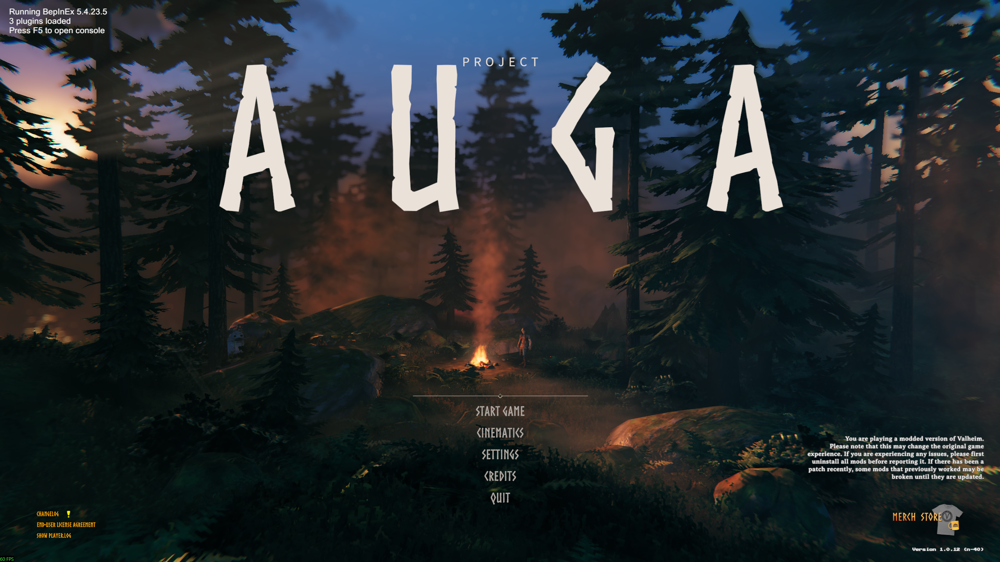
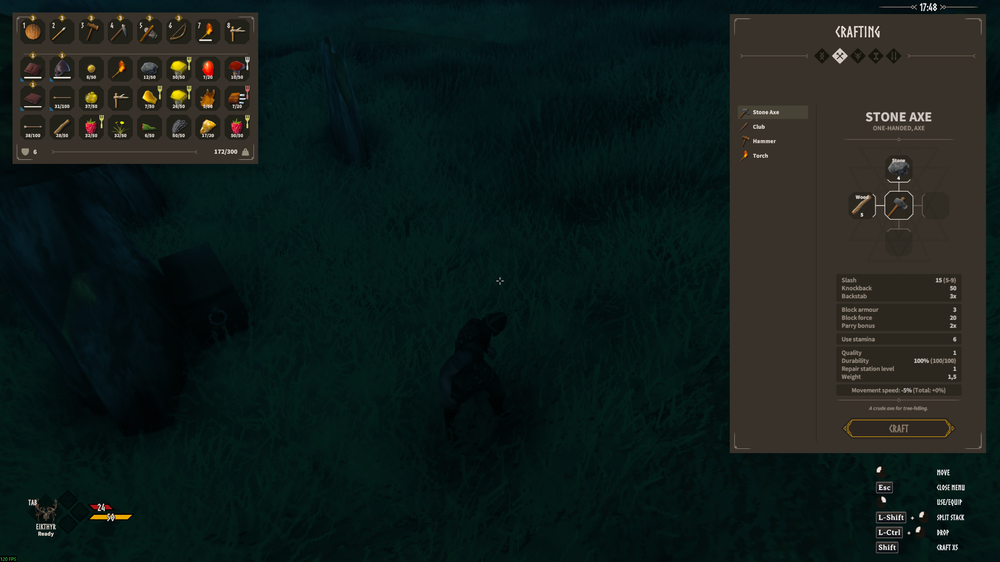
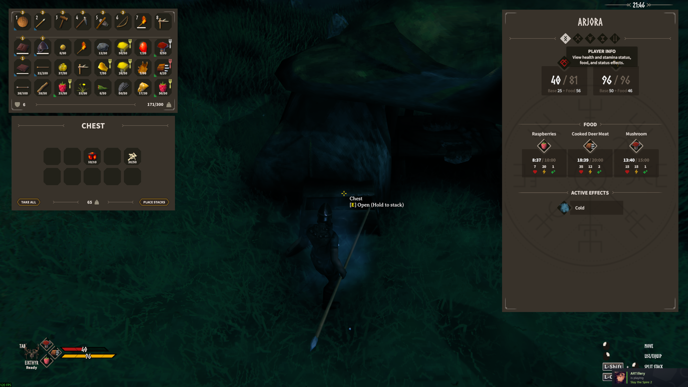
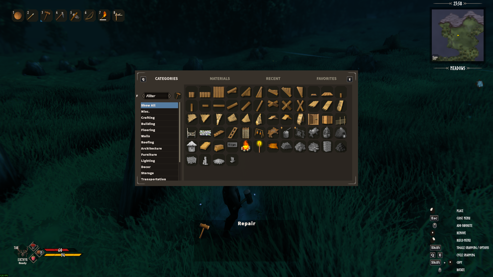
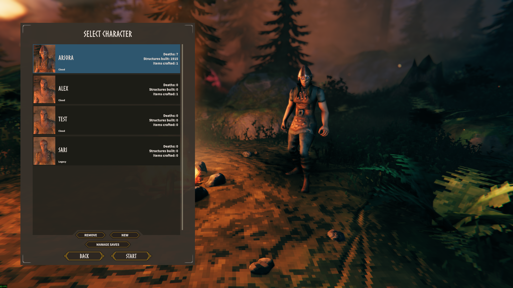
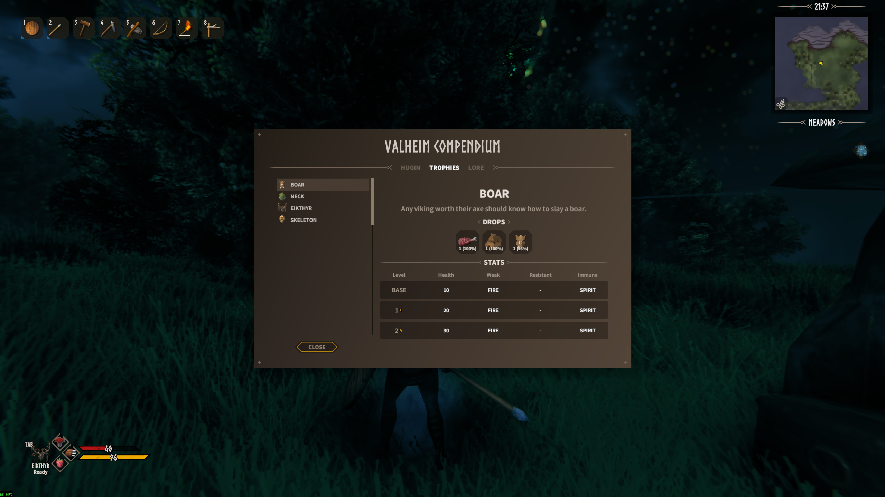
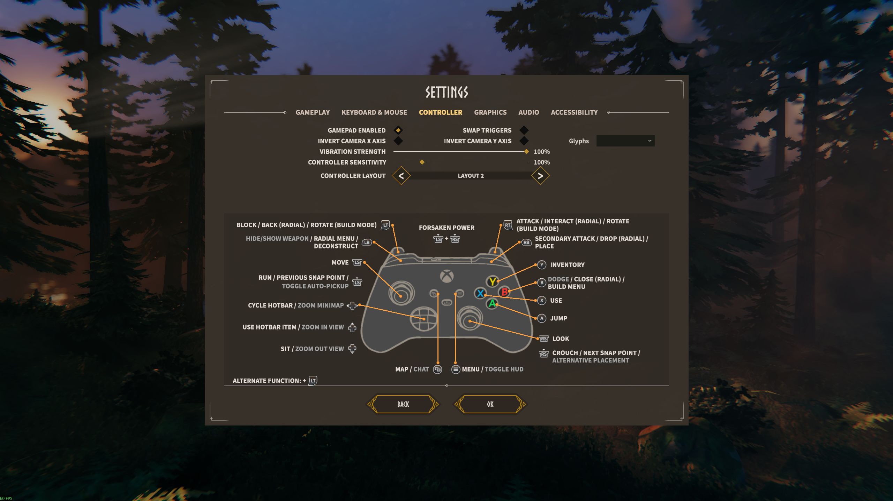

# Project Auga
##### by RandyKnapp / n4

Project Auga is a completely re-imagined, modder-friendly UI-overhaul for Valheim. Every last piece of UI was considered and reworked from the ground-up to create a more helpful and immersive player experience, all while remaining familiar to Valheim veterans.

[View all 26 screenshots](screenshots/README.md) ? [Build and setup](README-SETUP.md) ? [Modding guide](docs/MODDING.md)

## What's Changed?

Basically everything:
  * New Player HUD
  * Redesigned Player & Container inventories
  * New Consolidated Player Panels
  * Improved Crafting Panels
  * Expanded Character Select & New Character Screens
  * Overhauled Loading Screens
  * Auga-Style EVERYTHING

## Screenshots

A look at this port's UI in-game. Select an image to view it at full resolution.

| Inventory and crafting | Containers |
| --- | --- |
|  |  |

| Building | Character selection |
| --- | --- |
|  |  |

| Compendium | Settings |
| --- | --- |
|  |  |

Browse the **[complete screenshot gallery](screenshots/README.md)** for the HUD, workbench, upgrades, skills, lore, server browser, save management, and all settings tabs.

## How to Install

  1. Install [BepInEx for Valheim](https://valheim.thunderstore.io/package/denikson/BepInExPack_Valheim/)
  1. Download the zip file from here on Thunderstore
  1. Install with your mod manager
  1. OR - Extract the contents of the `files` folder inside the zip file to <Your Valheim Installation Directory>\BepInEx\plugins\Auga

## Mod Compatibility

Does it work with...

  * EpicLoot: **YES**
  * Equipment & Quick Slots: **YES**
  * _Message me if your mod is compatible, I'll add it to this list! - RandyKnapp_

Project Auga drastically changes many parts of the Valheim UI. It will most likely not be compatible with other mods that modify the UI.

Please report bugs and mod conflicts on the [GitHub Issues Page](https://github.com/RandyKnapp/Auga/issues)!

## For Modders

Project Auga comes with an API that allows other mods to easily access its features and create UI elements in the Auga style. It's also open-source on GitHub.

For this native-UI port, start with the [modding guide](docs/MODDING.md), [API reference](docs/API-REFERENCE.md), and [buildable example](AugaApiExample/AugaApiExample.cs).

Run `scripts/Build-AugaApi.ps1 -Package` to validate the runtime/shim contract and create the current SDK. The guide covers restored tab/variant APIs, readiness, and superseded integration patterns. The historical API ZIPs are not the current SDK.
Source: https://github.com/RandyKnapp/Auga
